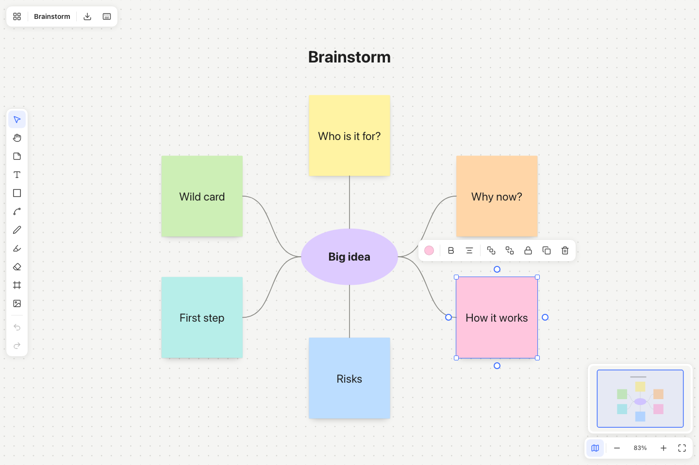

# Whiteboard

An open source infinite canvas for brainstorming, diagrams, and Kanban boards. Use it in a
browser or as a standalone macOS app. Boards save locally on your device, with no account
required.



## Start developing

Use Node.js 24 and npm.

```bash
git clone https://github.com/kma300/whiteboard.git
cd whiteboard
npm ci
npm run dev
```

Open `http://localhost:5173` in your browser. To run the desktop app during development, keep
the development server running and use `npm run app:dev` in another terminal.

## Features

* Infinite canvas with trackpad panning, zoom, a dot grid, and a minimap.
* Sticky notes, text, six shape types, images, frames, pen, and highlighter.
* Click a blue connection handle to create an empty matching item linked by an arrow, ready
  for typing. Repeated clicks create separate branches. Drag the handle onto an existing item
  to connect it, or onto empty canvas to create an item at that location.
* Straight, elbow, and curved connectors that stay attached when items move.
* Floating controls for shape, color, borders, text, and arrows. Menus stay inside the window,
  and related controls stay together in smaller windows.
* Selection, resizing, grouping, locking, duplication, and layer controls.
* Undo and redo, copy and paste, and customizable tool shortcuts.
* Blank, Brainstorm, Kanban, and Retrospective templates.
* A board dashboard with search, rename, duplicate, and JSON import and export.

## Build

Build the browser app and preview it locally:

```bash
npm run build
npm run preview
```

Build the desktop app on a Mac with Apple Silicon:

```bash
npm run app:build
```

The app is created at `release/mac-arm64/Whiteboard.app`. Copy it to `/Applications` to install
it. Quit and reopen the app after replacing an installed version.

The desktop build uses a local signature. Distribution to other Macs requires appropriate
Apple signing and notarization.

## Shortcuts

* `V`, `H`, `N`, `T`, `S`, `L`, `P`, `E`, `F`: Select, Hand, Sticky, Text, Shape, Connector,
  Pen, Eraser, and Frame.
* `R` and `O`: Rectangle and Ellipse.
* `Space` with drag: Pan. Use trackpad scrolling to pan and pinch to zoom.
* `Cmd+Z` and `Shift+Cmd+Z`: Undo and redo.
* `Cmd+C`, `Cmd+X`, and `Cmd+V`: Copy, cut, and paste.
* `Cmd+D`: Duplicate. `Cmd+G` and `Shift+Cmd+G`: Group and ungroup.
* `Cmd+]` and `Cmd+[`: Bring to front and send to back.
* `Shift+Cmd+L`: Lock or unlock.
* `Enter`: Edit the selected item's text. `Escape`: Finish editing or close a menu.
* Arrow keys: Move by 1 unit, or 10 with Shift. Delete or Backspace removes the selection.
* `Cmd+0`: Actual size. `Shift+1`: Fit the board. `Shift+2`: Fit the selection.

Tool keys can be changed using the keyboard button in the top bar. Browser keyboard commands
also support Ctrl where appropriate.

## Your data

The browser stores boards in IndexedDB for the current site. The desktop app stores its data
under `~/Library/Application Support/Whiteboard`. Browser and desktop boards are separate;
use JSON export and import to move them between installations.

The app is designed for personal use. It does not provide collaboration or a hosted sync
service.

## Contributing

Issues and pull requests are welcome. See [CONTRIBUTING.md](CONTRIBUTING.md) for the development
workflow.

```bash
npm run verify
```

This runs TypeScript checks, lint, formatting checks, the test suite, and a production build.
GitHub Actions runs the same checks for pushes and pull requests.

## License

[MIT](LICENSE). Copyright (c) 2026 Ken Ma.
